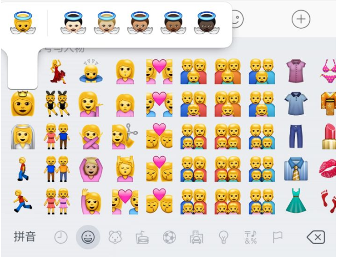

# 第二期：政治正确

## 议题

政治正确是在近代思想及政策研究中的专业名词，广义指在言论、行为上，不顾客观事实，迎合主流价值观、道德和舆论导向。也可以指那些无视事实，站在道德制高点上全力支持主流价值观的人。

在西方价值观中的政治正确，是指在政治立场上隐瞒真实想法与客观事实，在言语、政策、行为上不能“冒犯”少数族裔和弱势群体，对弱势群体“极其照顾”（特权），无视强势群体的正常需求，一味要求其忍让、包容、退让、付出等。

政治正确的支持者倾向采用“中立语言”（inclusive language）、“文明语”（civility）来形容政治正确。反对者则认为政治正确属贬义词，与假道学、过度敏感、斤斤计较的意义近似。[百度百科](https://baike.baidu.com/item/%E6%94%BF%E6%B2%BB%E6%AD%A3%E7%A1%AE/2032825?fr=aladdin)

这个词我不愿意给他过多的定义，每个人都对它有自己的看法。政治正确到底在为弱势群体发声，还是假借舆论实现自己的利益，到底是引导前进的光还是桎梏自由的锁，他到底为什么存在，未来又将带给世界怎样的变化。

同时，这不是一个孤立的命题，我们或多或少会谈论到一些其他的问题。有些问题可能很敏感，如女权、民族、LGBT，有些问题可能很空泛，如形式平等、言论自由。衍生问题不做限制，自由发挥。

期待你的观点。

